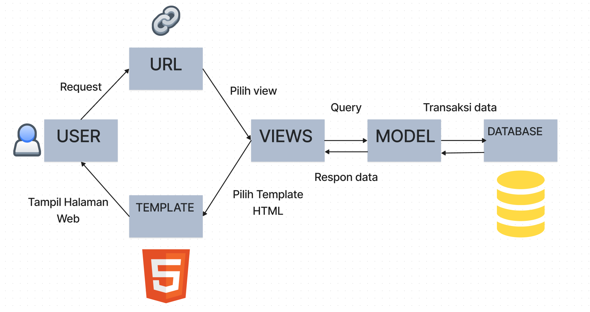

# Tugas 2 PBP

## Jawaban untuk soal tugas 2

### **Nomor 1**: Jelaskan bagaimana cara kamu mengimplementasikan checklist di atas secara step-by-step (bukan hanya sekadar mengikuti tutorial).

1. Membuat sebuah proyek Django baru.
    - Untuk membuat proyek Django baru, pertama-tama membuat virtual environment pada direktori proyek terlebih dulu.
    ```
    python -m venv env
    ```
    - Setelah itu, nyalakan virutal environment-nya.
    ```
    env\Scripts\activate.bat
    ```
    - Membuat `requirements.txt` di repositori yang sama yang kemudian menambahkan dependencies yang dibutuhkan.
    - Menjalankan perintah `pip install -r requirements.txt` untuk meng-install depedencies.
    - Membuat folder proyek dengan menjalankan command `django-admin startproject item_inventroy .`.
    - Untuk mengizinkan semua host, menambahkan `"*"` di `ALLOWED_HOSTS` pada `settings.py`.
    - Menambahkan konfigurasi `.gitignore` untuk menetukan direktori yang diabaikan oleh git.

2. Membuat aplikasi dengan nama `main` pada proyek tersebut.
    - Menjalankan perintah `python manage.py startapp main` untuk membuat aplikasi baru bernama `main`.
    - Menambahkan `'main'` kedalam variable `INSTALLED_APPS` pada `settings.py` di dalam direktori `item_inventory`.
    - Membuat direktori `templates` dan menambahkan `main.html`.

3. Melakukan routing pada proyek agar dapat menjalankan aplikasi `main`.
    - Menambahkan `'path('main/', include('main.urls'))'` kedalam variable `urlpatterns` di berkas `urls.py` pada direktori `item_inventory`.

4. Membuat model pada aplikasi `main` dengan nama Item dan memiliki atribut wajib.
    - Di dalam berkas `models.py`, saya menambahkan beberapa attribut pada class `Product`
        - `name`
        - `date_added`
        - `amount`
        - `description`
        - `power`
        - `mana`
        - `categories`

5. Membuat sebuah fungsi pada `views.py` untuk dikembalikan ke dalam sebuah template HTML yang menampilkan nama aplikasi serta nama dan kelas kamu.
    - Di dalam berkas `views.py`, saya menambahkan fungsi `show_main` dan menambahkan konteks `nama`, `class`, dan `app` untuk dirender ke `main.html`.
    - Kemudian, konteks yang sebelumnya sudah ditambahkan di fungsi `show_main` akan dipanggil di `main.html` dengan `{{ name }}` untuk salah satu contohnya.

6. Membuat sebuah routing pada `urls.py` aplikasi main untuk memetakan fungsi yang telah dibuat pada `views.py`.
    - Menambahkan berkas `urls.py` di dalam direktori `main`.
    - Menambahkan variable `app_name = 'main'` serta `path('', show_main, name='show_main'),` pada variable list `urlpatterns` di `urls.py`.

7. Melakukan deployment ke Adaptable terhadap aplikasi yang sudah dibuat sehingga nantinya dapat diakses oleh teman-temanmu melalui Internet.
    - Melakukan `add`, `commit`, dan `push` ke repository `tugas-2-pbp`.
    - Melakukan deeploy di `adaptable.io`.

### **Nomor 2**: Buatlah bagan yang berisi request client ke web aplikasi berbasis Django beserta responnya dan jelaskan pada bagan tersebut kaitan antara `urls.py`, `views.py`, `models.py`, dan berkas `html`.



- User merequest terhadap `urls`
- Setelah diidentifikasi path URLnya oleh django, sudah ditentukan `view` yang akan menangani request user `(routing)`.
- `View` akan menggunakan `model` untuk memproses request yang akan meneruskannya ke `template`.
- `Template` akan menghasilkan respon yang sesuai.
- HTML atau `template` diterima oleh user melewati web browser

### **Nomor 3**: Jelaskan mengapa kita menggunakan virtual environment? Apakah kita tetap dapat membuat aplikasi web berbasis Django tanpa menggunakan virtual environment?

Virtual environment adalah seperti sebuah kotak penyimpanan khusus yang digunakan untuk menyimpan berbagai perangkat dan alat yang diperlukan dalam suatu proyek tertentu. Ini membantu kita menjaga proyek-proyek yang berbeda tetap terpisah satu sama lain.

Misalnya, jika kita sedang bekerja pada beberapa proyek atau aplikasi yang menggunakan modul yang sama, tetapi memerlukan versi yang berbeda dari modul tersebut, maka virtualenv sangat berguna.

Sebagai contoh, ketika kita sedang mengembangkan sebuah aplikasi web dengan Flask versi 0.12.x, dan kemudian kita juga ingin mengembangkan aplikasi lain dengan Flask versi 1.1.x, virtualenv akan membantu kita menjaga proyek-proyek tersebut tetap terisolasi dan tidak saling mempengaruhi. Dengan cara ini, kita dapat bekerja dengan lebih efisien dan aman. Namun, Jika kita tidak menggunakan virtualenv, maka aplikasi atau proyek pertama yang menggunakan Flask 0.12.x akan secara tidak sengaja berubah menjadi Flask 1.1.x, dan semua modul yang dibutuhkan akan terus diperbarui setiap kali kita menggunakan perintah 'pip'.

### **Nomor 4**: Jelaskan apakah itu MVC, MVT, MVVM dan perbedaan dari ketiganya.
MVC (Model View Controller) merupakan salah satu pola arsitektur yang sangat terkenal dan banyak digunakan dalam industri perangkat lunak. Pola ini membantu dalam pemisahan peran dengan membagi aplikasi menjadi tiga komponen utama: `Model`, `View`, dan `Controller`. Dalam konteks aplikasi MVC, komunikasi antar komponen biasanya mengikuti pola pengamat. Tampilan berfungsi sebagai pengamat yang terdaftar pada pengontrol, sementara model terdaftar sebagai subjek pada pengontrol. Ketika model mengalami perubahan, model tersebut memberi tahu pengontrol, yang kemudian bertanggung jawab untuk memperbarui tampilan.

MVT (Model View Template) adalah pola desain perangkat lunak. Ini terdiri dari tiga komponen penting, yaitu Model, View, dan Template. Model digunakan untuk mengelola basis data. Ini adalah lapisan akses data yang mengelola data. Template adalah lapisan presentasi yang sepenuhnya menangani bagian Antarmuka Pengguna. View digunakan untuk menjalankan logika bisnis dan berinteraksi dengan model untuk mengambil data dan menyajikan template.

MVVM (Model-View-ViewModel) adalah sebuah kerangka kerja atau pola desain perangkat lunak yang membantu memisahkan logika bisnis dari tampilan atau kontrol antarmuka pengguna (UI) menjadi tiga bagian, yaitu model, tampilan, dan tampilan-model (viewmodel). Model didapatkan dari viewmodel setelah menerima input pengguna melalui view. View menginformasikan viewmodel apa yang dilakukan oleh pengguna. Viewmodel mendapatkan input dari view mengenai aktivitas pengguna, dan melakukan data binding 2 arah (2-way data binding).

MVT adalah konsep yang khusus untuk kerangka kerja Django dan mirip dengan MVC, dengan perbedaan utama berupa penggunaan template untuk menghasilkan tampilan. Sedangkan Tampilan dalam MVC lebih umumnya merujuk pada tampilan yang ditampilkan kepada pengguna. Untuk MVVM, berbeda dengan MVC dan MVT, karena MVVM sendiri mengimplementasikan data binding yang tidak dimiliki oleh MVC dan MVT.

### **BONUS TUGAS 2**
Untuk unit tester django, saya mengetest-kan model-model yang sudah saya implementasikan apakah sudah berjalan dengan baik.

# Tugas 3 PBP

## Jawaban untuk soal tugas 3

### **Nomor 1**: Apa perbedaan antara form POST dan form GET dalam Django?

GET lebih tepat digunakan saat kita hanya ingin mengambil data yang sederhana dan ringan, seperti saat mengakses halaman pencarian di sebuah situs web. Di sisi lain, POST lebih sesuai ketika kita perlu mengirimkan data yang bersifat rahasia atau data yang lebih kompleks, seperti saat melakukan proses login, mengirim email, atau mengisi formulir dengan banyak informasi.

### **Nomor 2**: Apa perbedaan utama antara XML, JSON, dan HTML dalam konteks pengiriman data?

HTML adalah fondasi yang penting untuk membuat halaman web yang fungsional dan estetis. Bahasa ini berfungsi untuk membuat struktur website hingga menyusun format teks dan gambar pada halaman web. Untuk XML dan JSON, keduanya merupakan format yang digunakan untuk menukar data dengan server. Perbedaan paling terlihat dari keduanya adalah cara menyimpannya, XML menyimpan data dengan cara yang terstruktur dan dengan mudah dibaca oleh mesin maupun manusia, akan tetapi kurang efisien. Sedangkan, JSON  menyimpan data dengan cara menyimpannya yang akan lebih efisien karena menggunakan struktur data map yang mudah diakses. Sementara itu, XML menggunakan struktur data yang lebih terstruktur dan luas karena menggunakan struktur tree.

### **Nomor 3**: Mengapa JSON sering digunakan dalam pertukaran data antara aplikasi web modern?

JSON adalah salah satu format data yang sangat populer di internet karena kesederhanaan dan ringkasannya. Kelebihan ini membuat pemrosesan data menjadi lebih cepat, meningkatkan pengalaman pengguna, terutama ketika menyimpan preferensi dan pengaturan dari pengguna. JSON juga sering digunakan sebagai format pertukaran data dalam API untuk berbagai jenis aplikasi, pada umumnya pada web modern yaitu payment gateway untuk transaksi online.

### **Nomor 4**: Jelaskan bagaimana cara kamu mengimplementasikan checklist di atas secara step-by-step (bukan hanya sekadar mengikuti tutorial).

1. Membuat input `form` untuk menambahkan objek `model` pada app sebelumnya.
    - Membuat berkas `forms.py` pada direktori `main` untuk struktur form yang menerima data item baru.
    - Mengimport yang dibutuhkan dengan kode ini:
    ```
    from django.forms import ModelForm
    from main.models import Item
    ```
    - Membuat class `ItemForm` yang menerima parameter `ModelForm`, didalamnya tambahkan class baru `Meta` yang kemudian diisikan dengan kode ini:
    ```
    model = Item
    fields = ["name", "amount", "description", "power", "mana", "categories"]
    ```
    Tujuan dari kode diatas adalah untuk menunjukkan field dari model yang sudah dibuat sebelumnya yang digunakan untuk form.
    - Pada berkas `views.py` di `main` menambahkan import yang dibutuhkan dengan kode ini:
    ```
    from django.http import HttpResponseRedirect
    from main.forms import ProductForm
    from django.urls import reverse
    ```
    - Membuat fungsi baru `create_item` yang menerima parameter `request`, yang kemudian diisikan dengan `form = ItemForm(request.POST or None)` untuk membuat `ItemForm` baru yang kemudian divalidasi dengan `form.is_valid()`, dan disimpan dengan `form.save()`, pada akhiran fungsi tambahkan `return HttpResponseRedirect(reverse('main:show_main'))` untuk me-redirect ke main.
    - Mengubah fungsi `show_main` pada berkas `views.py`  menambahkan `items = Item.objects.all()` untuk mengambil seluruh object item yang disimpan di database.
    - Menambahkan `path('create-item', create_item, name='create_item'),` pada berkas `urls.py` di `main`.
    - Membuat berkas `create_product.html` pada direktori `main/templates` yang kemudian diisi table untuk form dengan `{{ form.as_table }}`, token `` untuk security, menandakan block untuk form POST dengan kode `<form method="POST">`, dan tombol submit `<input type="submit" value="Add Product"/>` untuk mengirimkan request ke view.

2. Tambahkan 5 fungsi views untuk melihat objek yang sudah ditambahkan dalam format HTML, XML, JSON, XML by ID, dan JSON by ID, serta membuat routing URL untuk masing-masing views yang telah ditambahkan sebelumnya.
    - Menambahkan fungsi `show_xml` pada `views.py` di `main` dengan kode ini:
    ```
    def show_xml(request):
        data = Item.objects.all()
        return HttpResponse(serializers.serialize("xml", data), content_type="application/xml")
    ```
    Kemudian menambahkan path routing `path('show_xml/', show_xml, name='show_xml'),` di `urls.py` pada `main`.
    - Menambahkan fungsi `show_json` pada `views.py` di `main` dengan kode ini:
    ```
    def show_json(request):
        data = Item.objects.all()
        return HttpResponse(serializers.serialize("json", data), content_type="application/json")
    ```
    Kemudian menambahkan path routing `path('json/', show_json, name='show_json'),` di `urls.py` pada `main`.
    - Menambahkan fungsi `show_xml_by_id` pada `views.py` di `main` dengan kode ini:
    ```
    def show_xml_by_id(request, id):
        data = Item.objects.filter(pk=id)
        return HttpResponse(serializers.serialize("xml", data), content_type="application/xml")
    ```
    Kemudian menambahkan path routing `path('xml/<int:id>/', show_xml_by_id, name='show_xml_by_id'),` di `urls.py` pada `main`.
    - Menambahkan fungsi `show_json_by_id` pada `views.py` di `main` dengan kode ini:
    ```
    def show_json_by_id(request, id):
        data = Item.objects.filter(pk=id)
        return HttpResponse(serializers.serialize("json", data), content_type="application/json")
    ```
    Kemudian menambahkan path routing `path('json/<int:id>/', show_json_by_id, name='show_json_by_id'),` di `urls.py` pada `main`.

### **BONUS TUGAS 3**
Untuk menunjukkan banyak jumlah item yang sudah ditambahkan pada aplikasi adalah dengan cara menambahkan `items_total = items.count()` di fungsi `show_main` di `views.py` pada `main` yang kemudian ditambahkan di variable `context`. Lalu, tambahkan templatenya pada `main.html`.

### Mengakses kelima URL di poin 2 menggunakan Postman, membuat screenshot dari hasil akses URL pada Postman, dan menambahkannya ke dalam README.md.


